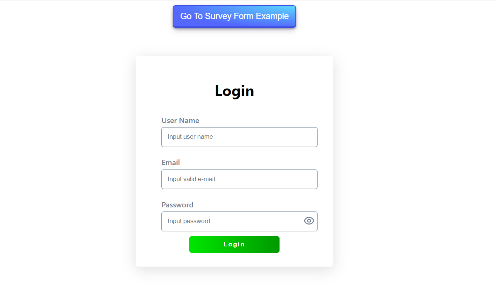
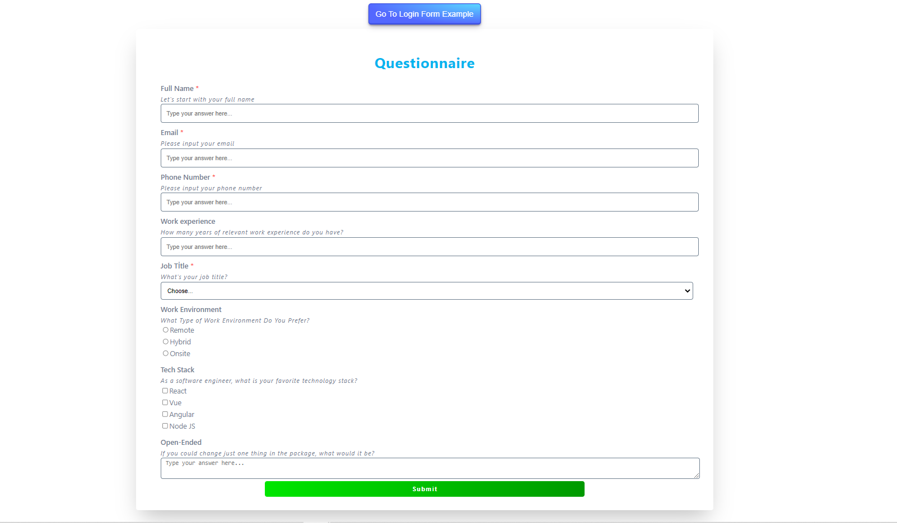

# react-formik-form-generator

This package is a small helper for generator forms with Formik, Yup validation and styled-component easily. It can generate login forms, survey forms and other forms on JSON schema model definition.

## Getting Started

### Installation

This package is already published to NPM, use `npm` or `yarn` to download to local directory.

```bash
npm install react-formik-form-generator
yarn add react-formik-form-generator
```

### Example

You can see example app with react-formik-form-generator.
[Click Here](https://react-formik-form-generator.herokuapp.com/)

This repository helps you to easily review using of the package with example.
[Click Here](https://github.com/Hkc1673/react-formik-form-generator-example#readme)




### Import ReactFormGenerator

```javascript
import ReactFormGenerator from "react-formik-form-generator";
```

### Basic usage

```jsx
<ReactFormGenerator
  formData={loginFormData}
  buttonTitle={"Login"}
  onSubmit={onSubmit}
/>
```

### Sample formData props

```javascript
const loginFormData = [
  {
    id: "name",
    label: "User Name",
    placeholder: "Input user name",
    type: "text",
    validationType: "string",
    value: "",
    validations: [
      {
        type: "required",
        params: ["Name is required"],
      },
    ],
  },
  {
    id: "email",
    label: "Email",
    placeholder: "Input valid e-mail",
    type: "text",
    validationType: "string",
    value: "",
    validations: [
      {
        type: "required",
        params: ["Email is required"],
      },
      {
        type: "email",
        params: ["Please enter a valid email"],
      },
    ],
  },
];
```
